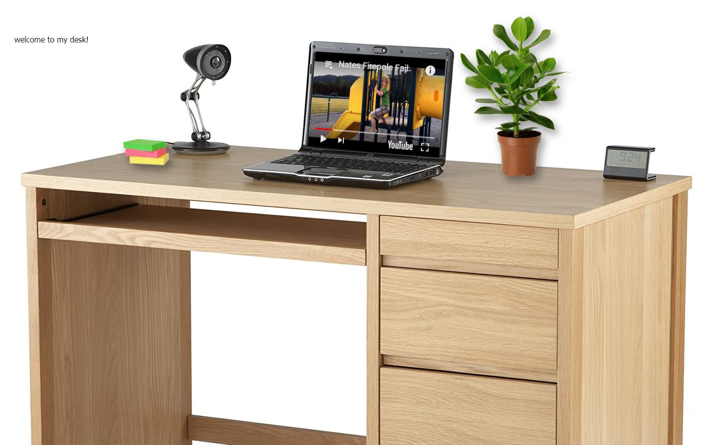

# same site different day

Welcome to my virtual desktop! :computer:

TODO:
- [ ] change website depending on the day of the week
- [ ] Add more desktops and [shitybattlestations](https://imgur.com/r/shittybattlestations)
- [ ] randomise videos
- [ ] build [calender](https://support.google.com/calendar/answer/41207?hl=en) (would be good if people could add events)
- [ ] build [clock](http://freefrontend.com/css-clocks/)
- [ ] add a plane for the desk and add three.js custom geometries with [physics](http://chandlerprall.github.io/Physijs/examples/shapes.html)

## running locally

- make sure [node.js](http://nodejs.org) is at version >= `6`
- `npm i spike -g`
- clone this repo down and `cd` into the folder
- run `npm install`
- run `spike watch` or `spike compile`

## Testing
Tests are located in `test/**` and are powered by [ava](https://github.com/sindresorhus/ava)
- `npm install` to ensure devDeps are installed
- `npm test` to run test suite
